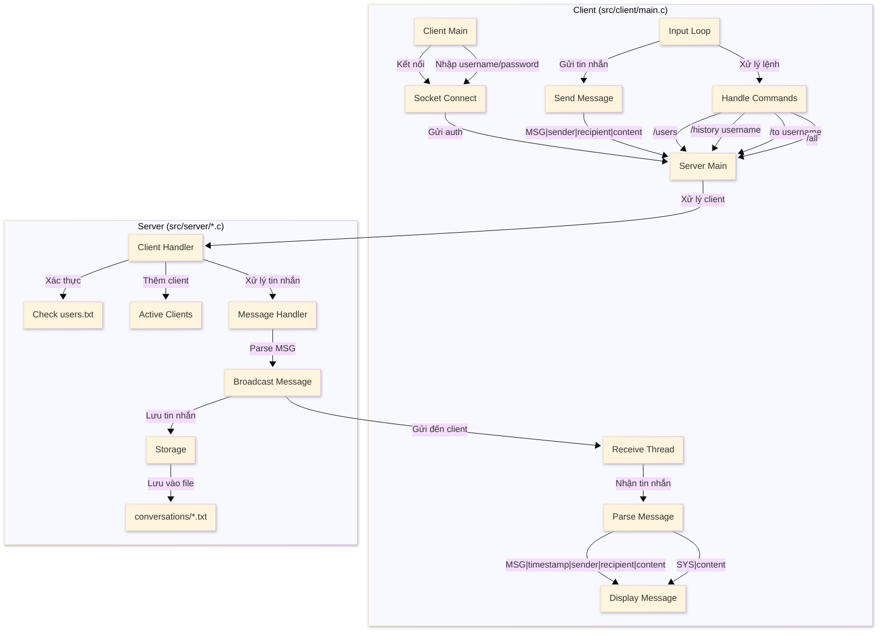

# Kiến Trúc Hệ Thống Chat

## Sơ Đồ Luồng Xử Lý

## Giải Thích Chi Tiết

### 1. Client Side (src/client/main.c)
- `Client Main`: Khởi tạo kết nối và xác thực
- `Input Loop`: Xử lý input từ người dùng
- `Send Message`: Gửi tin nhắn theo format mới
- `Handle Commands`: Xử lý các lệnh đặc biệt
- `Receive Thread`: Thread riêng để nhận tin nhắn

### 2. Server Side
- `Server Main (src/server/main.c)`: Khởi tạo server
- `Client Handler (src/server/client_handler.c)`: Xử lý từng client
- `Message Handler (src/server/message.c)`: Xử lý tin nhắn
- `Storage (src/server/storage.c)`: Lưu trữ tin nhắn

### 3. Storage Format
- `all.txt`: Tin nhắn công khai
- `user1_user2.txt`: Tin nhắn riêng
- Format: `MSG|timestamp|sender|recipient|content|is_private`

### 4. Luồng Xử Lý Chính
1. Client kết nối và xác thực
2. Server kiểm tra users.txt
3. Client gửi tin nhắn: `MSG|sender|recipient|content`
4. Server thêm timestamp và lưu
5. Server gửi đến client: `MSG|timestamp|sender|recipient|content`
6. Client nhận và hiển thị

### 5. Các File Chính
- `src/client/main.c`: Xử lý client
- `src/server/main.c`: Khởi tạo server
- `src/server/client_handler.c`: Xử lý client
- `src/server/message.c`: Xử lý tin nhắn
- `src/server/storage.c`: Lưu trữ
- `users.txt`: Thông tin người dùng
- `conversations/*.txt`: Lưu trữ tin nhắn